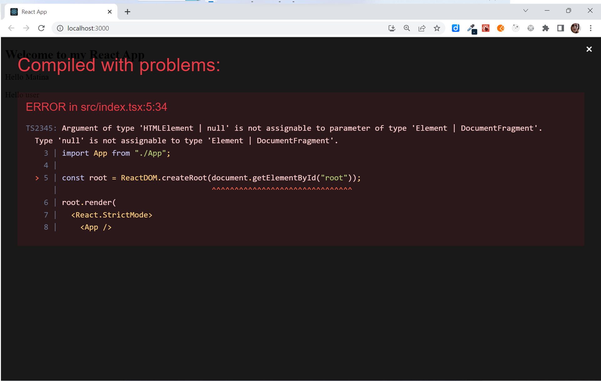

# TypeScript

In Visual Studio code, press `command+shift+v` (Mac) or `ctrl+shift+v` (Windows) to open a Markdown preview.

## Reasons for Challenge

TypeScript is a very marketable skill for those of you who are job searching. It is a very useful tool that stops you from introducing type related bugs from application.

## Examples and Documentation

- [React TypeScript Cheatsheet](https://react-typescript-cheatsheet.netlify.app/docs/basic/getting-started/basic_type_example)
- [React events and TypeScript: a complete guide](https://devtrium.com/posts/react-typescript-events)
- TypeScript and React: [Components](https://fettblog.eu/typescript-react/components/) | [Hooks](https://fettblog.eu/typescript-react/hooks/) | [Events](https://fettblog.eu/typescript-react/events/)
- [ErrorBoundaries](https://react-typescript-cheatsheet.netlify.app/docs/basic/getting-started/error_boundaries)
- [TutorialsTeacher](https://www.tutorialsteacher.com/typescript)

## Getting Started & Instructions

You will be refactoring two of your previous assignments to use TypeScript.

- exercises/03-props/
- exercises/06-forms/
- exercises/14-suspense/

To convert these assignments to TypeScript assignment, you will need to navigate to the root of each and then install all React TypeScript dependencies. For example, for the _03-props_, you would do:

```
cd exercises/03-props/
code . # if you would like to open this in a separate VSCode window
npm install --save typescript @types/node @types/react @types/react-dom @types/jest --legacy-peer-dep
```

(The `--legacy-peer-dep` flag is to resolve TypeScript conflicts between the latest version of TypeScript that you are working with,and the version of TypeScript installed with [create-react-app](https://create-react-app.dev/). See https://github.com/facebook/create-react-app/issues/13080)

Create a file called _tsconfig.json_ in the root of the exercise (e.g. _exercises/03-props/tsconfig.json_). Copy and paste the code below and save:

```json
{
  "compilerOptions": {
    "target": "es5",
    "lib": ["dom", "dom.iterable", "esnext"],
    "allowJs": true,
    "skipLibCheck": true,
    "esModuleInterop": true,
    "allowSyntheticDefaultImports": true,
    "strict": true,
    "forceConsistentCasingInFileNames": true,
    "noFallthroughCasesInSwitch": true,
    "module": "esnext",
    "moduleResolution": "node",
    "resolveJsonModule": true,
    "isolatedModules": true,
    "noEmit": true,
    "jsx": "react-jsx"
  },
  "include": ["src"]
}
```

Rename the _index.js_ file as _index.tsx_ and then start the application with `npm start`. If you see this error:



This is because it is possible that `rootElement` can be null. For nullable values, TypeScript requires you to check and see if a value is null before continuing.

If you see the "Compiled with problems: ERROR in src/index.tsx" message, change these lines in your _index.tsx_ file:

```ts
import React from "react";
import ReactDOM from "react-dom/client";
import App from "./components/App/App"; // This line will vary from exercise to exercise

// Change these lines to resolve TypeScript issues
const rootElement = document.getElementById("root");
if (!rootElement) {
  throw new Error("Failed to find the root element");
}
const root = ReactDOM.createRoot(rootElement);

root.render(
  <React.StrictMode>
    <App />
  </React.StrictMode>
);
```

Rename all files that contain React components so that they end with _.tsx_. You will see errors on your screen. Your job is to refactor the code so that it is in TypeScript. For most errors, this means either declaring new types and interfaces or importing and using existing types from React.

You should also rename _countries.json_ and _states.json_ so that they end in _.ts_. You will need to export the countries and states as named exports. For example:

```ts
// In countries.ts
export const countries = [
  // ...
];

// In App.tsx
import { countries } from "./assets/countries";
```

Refactor the error boundary file to be this:

```ts
import { Component, ErrorInfo, ReactNode } from "react";

type ErrorBoundaryProps = {
  children?: ReactNode;
  fallback: ReactNode;
};

type ErrorBoundaryState = {
  hasError: boolean;
  error?: Error;
};

class ErrorBoundary extends Component<ErrorBoundaryProps, ErrorBoundaryState> {
  state: ErrorBoundaryState = { hasError: false, error: undefined };
  static getDerivedStateFromError(error: Error) {
    return {
      hasError: true,
      error,
    };
  }
  public componentDidCatch(error: Error, errorInfo: ErrorInfo): void {
    console.error("Uncaught error:", error, errorInfo);
  }
  render() {
    if (this.state.hasError) {
      return this.props.fallback;
    }
    return this.props.children;
  }
}

export default ErrorBoundary;
```

HINT: For the _fetcher_ function in _exercises\14-suspense\src\CatFact.jsx_, you won't be able to spread the arguments anymore. Before saving _CatFact.jsx_ as a TypeScript file, you can change the arguments so that your only argument is the url ...

```js
const fetcher = (url) => axios(url).then((res) => res.data.fact);
```

... and then save as _.tsx_ and add TypeScript types to it.

## Acceptance Criteria

- Your application starts without any errors.
- All files with React components to end with the _.tsx_ extension.
- All former JSON files end with the _.ts_ extension.
- All of your code has typed annotations.
- You do not use the `any` type anywhere.
