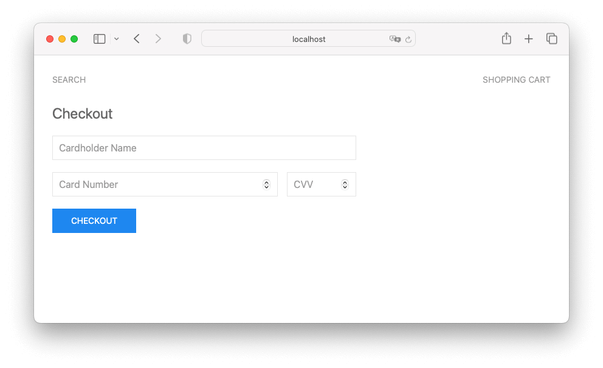
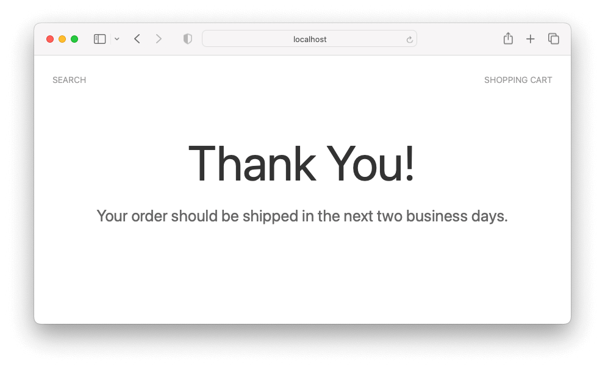
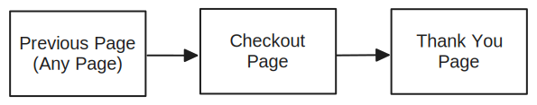
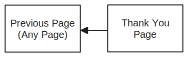
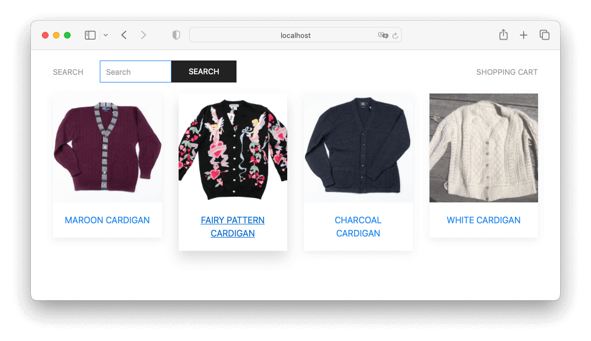
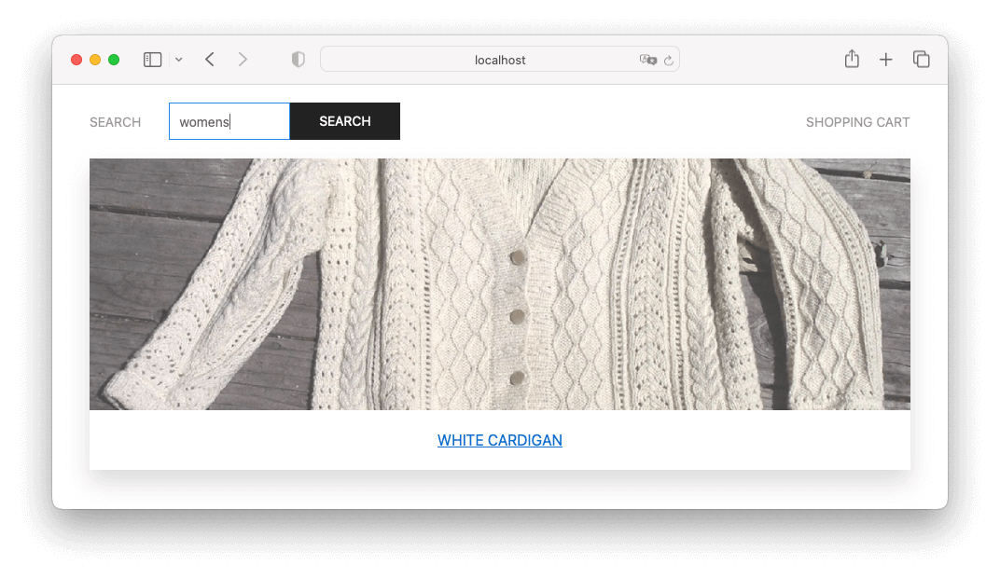
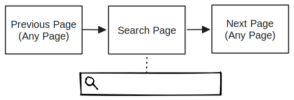
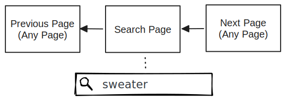

# Navigation and History Challenge

In Visual Studio code, press `command+shift+v` (Mac) or `ctrl+shift+v` (Windows) to open a Markdown preview.

## Reasons for the Challenge

_Reason for navigation challenge_: Sometimes, a link is not always the right tool for the job. For example, lets say we need our users to navigate to a new page after submitting a form. React Router's `useNavigate` hook is an alternative to links that enables us to change the URL and navigate to new screens.

_Reason for browser history challenge_: Nothing is more frustrating for your users then when their browser's back and forward buttons don't work like they expect. In React, you can modify browsing history so that you can deliver a better user experience. The `useNavigate` hook from React Router will enable you to rewrite history.

_Another reason for browser history challenge_: Whenever user navigates back and forth in history, you will loose local state in memory. You can refactor your react components so that your state is stored in some type of global state, but this will make your state much more difficult to manage and your React components tightly coupled. Plus, your app will still loose all state in memory anyways whenever the user refreshes the page.

A much more elegant solution is to store state in history. When the user navigates with the browser's back button, forward, and refresh buttons, your state will still be in tact.

## Getting Started

Using your command line, you will need to navigate to the this folder, install all dependencies, and start the app.

```bash
cd exercises/17-navigation/
code . # if you would like to open this in a separate VSCode window
npm install
# If you get dependency conflicts, try installing with: npm install --legacy-peer-deps
npm start
```

## Challenge 1

You will work on submitting a credit card form and navigating to a thank you page.

### User Stories

As a shopper, I need to fill out a checkout form so that I can place my order.

As a shopper, I would like to get feedback that my order was successful made.

As a shopper, I am not interested in seeing the checkout screen again when I hit the back button, because I will not need to fill out the checkout form again.

As a cybersecurity engineer, I do not want to display the credit card form on the screen whenever it isn't necessary, because credit card forms are a liability.

### User Journey

When the user clicks on the "Shopping Cart" link, they will need to fill out a credit card form.



Once they submit the form, they will be redirected to a thank you page.



This is the user's journey as they navigate from page to page:



And this is the user's journey if they click on the back button:



### Instructions

First, it is probably a good idea to open _src/components/App/App.tsx_ to see all the available URLs and understand how routing is working. You will not need to make any changes to this file.

Open _src/components/ShoppingCart/ShoppingCart.tsx_ and follow the instructions inside of the comments.

### Acceptance Criteria

- You used the 'useNavigate` hook from React Router to solve this problem.
- When the user submits the checkout form, they navigate to `/thank-you` and the "ThankYou" component renders on their screen.
- When the user navigates to the thank you screen, the thank you url (`/thank-you`) should replace the checkout form url (`/checkout`) so that when the user hits the back button, they do not see the checkout form.

## Challenge 2

### User Stories

As a user, I need to search for products so that I can find what I am looking for.

As a user, I expect to see the same search results when I navigate to a new page, and then press on the back button.

As a user, I do not want to search for a product again when I refresh the page.

### User Journey

When a user first navigates to the search page, they will see all of the products and the search textbox will be empty.



If the user fills out the search textbox and submits the search form, the page will filter the products so only the products relevant to search are displayed.



This is the user's journey as they navigate from page to page.



The search results should be saved in search history. Let's say that the user searched for "sweater". When they go back to the search page, the search textbox should have "sweater" filled out and the search results should only display products that are sweaters.

This is the user's journey if they click on the back button:



### Instructions

Like in the previous challenge, it is probably a good idea to open _src/components/App/App.tsx_ to see all the available URLs and understand how routing is working. You will not need to make any changes to this file.

Open _src/components/Search/Search.tsx_ and follow the instructions.

### Acceptance Criteria

- You used the 'useNavigate` hook from React Router to solve this problem.
- When the user navigates back in history, the search textbox should be filled out with whatever the user last searched for.
- When the user navigates in history, the search page should only display products relevant to the search.
- The search page should only take one slot in history. If I am on the search page, and I click on the back button, I should then see a page that is different from the search page.
