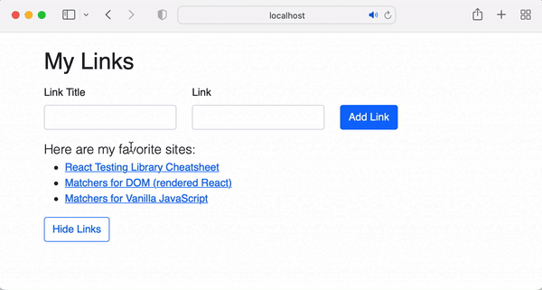

# Automated Testing in React

In Visual Studio code, press `command+shift+v` (Mac) or `ctrl+shift+v` (Windows) to open a Markdown preview.

## Reasons for this Challenge

We write unit tests to catch bugs, make refactoring code easier, and to improve code quality. The purpose of this challenge is to teach you how to react automated unit tests in React.

## Documentation

For this assignment, we will be using the following testing libraries:

- Jest to run the tests, which is [built into create-react-app](https://create-react-app.dev/docs/running-tests/).
- React Testing Library and to render React components and query what is on the screen. See the [cheatsheet](https://testing-library.com/docs/react-testing-library/cheatsheet) and [full example](https://testing-library.com/docs/react-testing-library/example-intro).
- Testing Library [queries](https://testing-library.com/docs/queries/about) and [asynchronous queries](https://testing-library.com/docs/dom-testing-library/api-async) to assert that React elements have rendered onto the page.
- [Jest](https://jestjs.io/docs/using-matchers) and [jest-dom](https://www.npmjs.com/package/@testing-library/jest-dom) for other assertions.
- Testing Library to trigger [user events](https://testing-library.com/docs/dom-testing-library/api-events).

## Getting Started

Using your command line, you will need to navigate to the this folder, install all dependencies.

```shell
cd exercises/19-automated-testing/
code . # if you would like to open this in a separate VSCode window
npm install --legacy-peer-deps
```

With this exercise, you will be writing and running the tests.

```shell
npm test
```

If the test says "No tests found related to files changed since last commit.", press `a` to run the test.

If, at any time, you need to quit the tests, press `ctrl + c`.

## User Stories

Note that for this assignment, you will not be working on the UI - you will we writing the tests for the functions and UI instead. However, we are including these unit tests to give you context on the application that you are testing. You can, of course, run `npm start` to demo what this application is doing.



As a user, I would like to create a list of links.

As a user, I would like to add a new link to my list of links.

As a user, I would like to hide my list of links.

## Instructions

Open the file _src/utils/someRandomFunctions.test.ts_ and follow the instructions.

Open the file _src/components/App/App.test.tsx_ and follow the instructions.

## Acceptance Criteria

- All tests - both the tests started for you and the tests you are instructed to write - must pass
- Your tests must not return any false positives

If you completed the assignment, your test output should look like this:

```
 PASS  src/components/App/App.test.js
  ✓ should render a heading (44 ms)
  ✓ should render three links to the screen when the component first mounts (15 ms)
  ✓ should include a textbox called "Link" and the user can type in this textbox (21 ms)
  ✓ should render "Here are my favorite sites:" (10 ms)
  ✓ should render two buttons onto the screen (8 ms)
  ✓ should include a textbox called "Link Title" and the user can type in this textbox (12 ms)
  ✓ should hide the links when the hide button is clicked (14 ms)
  ✓ should add the user input to the new li

Test Suites: 1 passed, 1 total
Tests:       8 passed, 8 total
Snapshots:   0 total
Time:        1.655 s, estimated 2 s
```
