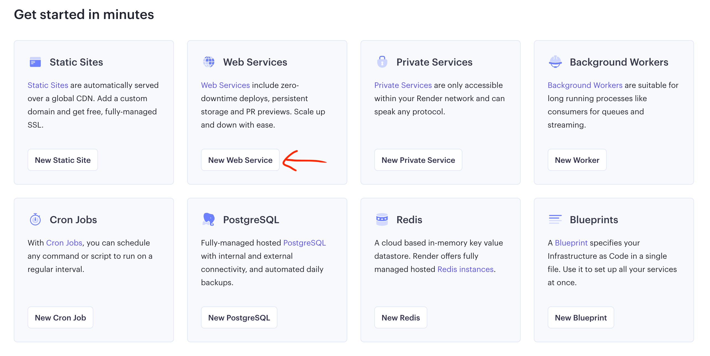
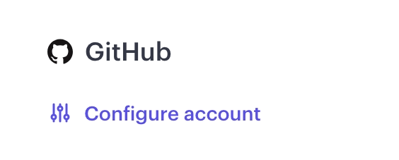
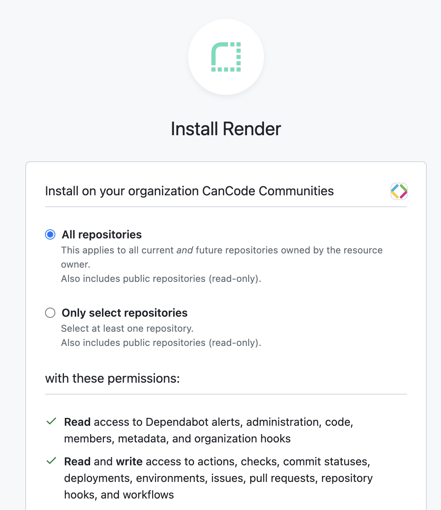
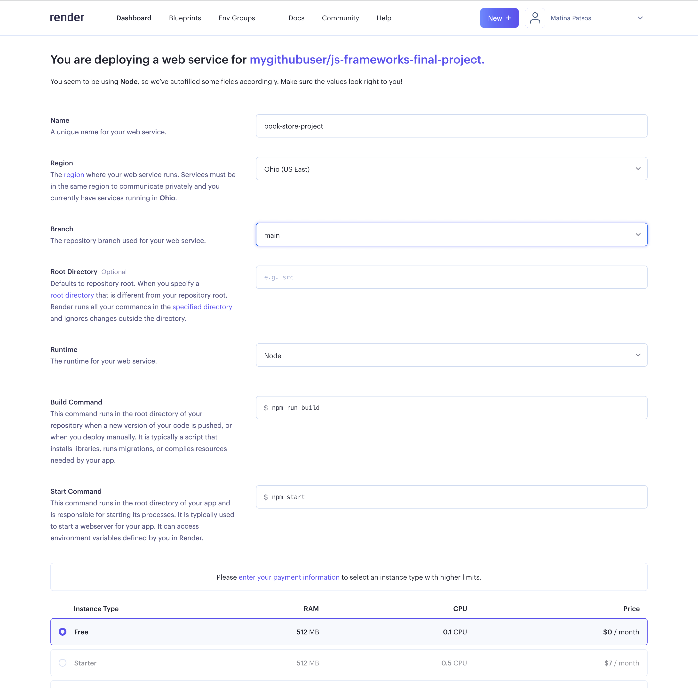
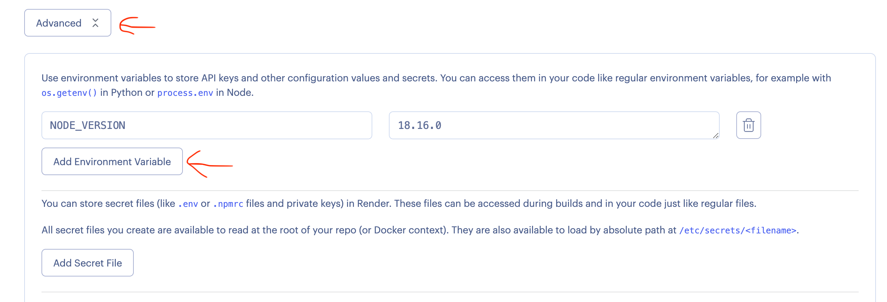
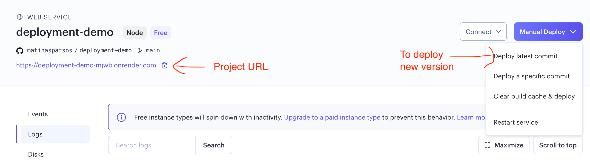

# Project 2: Final Project

**Due September 22, 2023 End of Day**

For your second and final project, you have a choice of these projects:

1. [Building a book store website](book-store/README.md)
2. [Building an AI text splitter](ai-splitter/README.md)

## Project Goals

- To put together and make practical use of what was taught in class.
- To get some experience integrating your front-end with a back-end.
- To learn about developer practices, like setting up an application, maintaining your own git repository and writing a _README.md_.
- To learn how to deploy and share your project.
- To build a portfolio piece to show off to potential employers.

This project will put together these topics that were covered in class:

- Share global state with the Context API
- AJAX with the `useEffect` hook or `<Suspense />`
- Routing
- Authentication
- TypeScript

## Getting Started

For this project, you will start by forking an existing codebase. The existing codebase contains the back-end of your project. You will be writing the front-end.

To begin, click on one of the links below:

- [Book store](https://github.com/AlbanyCanCodeCourses/BookStoreProject.git)
- [AI Text Splitter](https://github.com/AlbanyCanCodeCourses/AISplitterProject)

Fork the repo and clone your forked version in someplace that you will remember it (e.g. _~/Documents_). Open the folder in Visual Studio Code. Open your terminal and install the server.

```
npm install
```

To start the server, run `npm run start`. You should see this:

```
Your server is running on http://localhost:3001/
Press ctrl+c to stop
```

If you open _http://localhost:3001/_ in your browser, Thunder Client or Postman, you should see a message like this:

```
Its running! To use the API, please refer to the Project README.md.
```

Next, open up a new terminal. (You can either use split screen, or press the plus icon). You are going to create a folder called _client_, which will contain the React app that you will be working on.

```
npx create-react-app client --template typescript
```

Your project structure should look like this:

```
.git/
client/
  # React files:
  - .git/ # We are going to remove this
  - src/
    - ...
  - node_modules/
  - package.json
  - package-lock.json
  - tsconfig.json
node_modules/
server/
  # Server files ...
.gitignore
package.json
package-lock.json
tsconfig.json
```

You will first want to remove git from the _client_ folder, because you will need to commit the server to git too. You should only have one git repo for the entire project.
ls

```
cd client
rm -rf .git
rm .gitignore # Recommended because we already have this at the root level
```

To avoid CORS issues, we are going to proxy the server. (What this essentially means is that instead of sending AJAX requests to e.g. _http://localhost:3001/api/signin_, you would send it to _/api/signin_. This will make it easier for those of you who want to host your project on a site like Render.) Open up the _client/package.json_ file and add this:

```json
{
  "name": "client",
  "version": "0.1.0",
  "private": true,
  // ...
  "proxy": "http://localhost:3001"
}
```

Now you should ready to go. Start the app with `npm start`.

In order to work on this project, you will need two terminal windows open - one window running the your client code, and the other window running the back-end server. When you install libraries, like React Router, you may need to include the _--legacy-peer-deps_ flag to [resolve issues with TypeScript and create-react-app](https://github.com/facebook/create-react-app/issues/13080). For example, `npm install react-router-dom --legacy-peer-deps`.

### Styling Your Project

We do not have example HTML or CSS for this project. We suggest that you use a CSS framework like [Bootstrap](https://getbootstrap.com/), [Ant Design](https://ant.design/), [Material UI](https://mui.com/) or [Tail Wind](https://tailwindcss.com/). Here are a few different ways to include CSS frameworks and styling components to your project:

- Add a CDN link to the _index.html_ file of your project.
- Install a CSS library with npm. Import the library's entry CSS file in your _index.js_ file.
- Install an NPM library like [Material UI](https://mui.com/) or [React Bootstrap](https://react-bootstrap.netlify.app/) with npm. Follow the library's documentation and import the components from the library where needed.

## Project Requirements

Detailed requirements and API documentation for each project can be found here:

- [Book store website](book-store/README.md)
- [AI text splitter](ai-splitter/README.md)

## Tips

Create diagrams of each component, what it puts in state, what is shared in the global state, what AJAX requests it makes, what data it sends and receives, and how the user will navigate from one component to the next.

A good place to start is with routing. Create a bunch of components that say, at first, "Hello World". Link the components to each other where needed.

Use React Router's `<Link>` tag to navigate to new components.

You can copy a lot of your code from the [final project example](../../examples/final-project) into this project.

In most places, it is recommended that you store data and other state in React component's local state. The Context API and any other state management libraries should really only be used for state that is shared between most components.

The book or collection IDs will drive most of your application. You will receive books IDs in your response when you make an AJAX request to search for a book, open the bookshelf or modify a bookshelf. You should place book IDs into `<Link>` paths to new screens (see how we linked to the movie details page in the [React Router example](https://codesandbox.io/s/react-router-v5-with-react-18-1c116m?file=/src/components/App/App.jsx). You will also need to carry the books IDs from one AJAX request to another when a user modifies their bookshelf or views details on a single book.

Try to make your components stateless. For example, say that you are building the book store website. The user is on the _Search_ screen and she is searching for _gardening_. She thens clicks on a book called _The Art of Gardening_ and is taken to the _Book Details_ page. Now, you may decide to carry over the details like title and author from the search results to the _Book Details_ screen. However, I recommend that you simply make an AJAX request within the Book Details component to look up the information you need instead of relying on the data from the search results. Here is why:

1. You will need to make an AJAX request on the _Book Details_ screen anyways. If the user refreshes the page, the component will lose its state.
2. Carrying over state from one component to the next is difficult.
3. If your components are stateless, then your code is reusable.

You may find it helpful to use Visual Studio Code's Thunder Client extension or the standalone [Postman application](https://www.postman.com/) to test our your AJAX requests before building them into React.

When making AJAX requests, try to log your response (`console.log`) at first so that you can figure out which part of the response contains the data that you need. Alternatively, you view AJAX requests within the "Network" tab of your browser's DevTools.

Talk to your instructors and talk to them earlier on. They can guide you on designing the architecture and overflow flow of your application so that you are not stuck the night before the project is due.

### Code Quality

While your grade is not determined on whether or not you follow these code quality tips, we encourage you to code to a professional standard. One of the goals of this project is to help you build a portfolio. Just like an interviewer will judge you on your attire, employers will judge you on the neatness of your code.

- You should have README.md written in Markdown. It should explain the purpose of the project, give instructions on how to install and start your project and credit yourself as the author. Here are some resources on creating _README.md_ files:
  - [Make a README](https://www.makeareadme.com/)
  - [Markdown cheatsheet](https://github.com/adam-p/markdown-here/wiki/Markdown-Cheatsheet)
- Add anything that should not be committed to your _.gitignore_ file. Your _node_modules_ and _client/build_ folder should be ignored.
- Choose descriptive and specific names for React components, constants, functions and anything else that is named.
- You must not leave any debugging statements in your code. Remove any `console.log()` statements from your code before committing.
- Only have actual comments within comment tags. Do not commit code that you commented out for debugging purposes.
- No errors should appear in the console.
- Remove any components or code that is not being used. (This affects application load time as well as code quality.)
- Use proper indentation. (Prettier can take care of this.)

## Hosting Your Project

You will need to host a demo of your final project. You must choose a host that will allow you to deploy a Node.js web service. I recommend Render.com because it meets this criteria and has a free tier available. Note that with the free tier, your demo will take a long time to load if it has been inactive for more than 15 minutes.

If you choose Render, here is how you can get started

1. Visit [Render's website](https://render.com/) and click on the "Get Started" button. Proceed to create an account. I suggest you create an account with GitHub, because we are going to use it in the next steps.
2. Click on "Dashboard" in the navbar on the top of your screen.
3. Underneath "Web Services", click on "New Web Service".



4. You should see the "Create a new Web Service" page. In the sidebar on the right, click on "Connect Account" underneath GitHub. You may be asked to login to your GitHub account.



5. Underneath "Install Render" screen, I recommend that you choose "Select all repositories". You can select a single repository, but it will you need to change this if you want to host another project later. Scroll down and click "Install".



6. You should return to the "Connect a repository" screen and you should see your project in a list of GitHub repositories. Click on the "Connect" button next your final project.

7. You should see "You are deploying a web service for ...". Enter the following;
   - Provide a name for your app
   - Change the region to _Ohio (US East)_
   - The root directory should be blank
   - The runtime should be "Node"
   - The build command should be `npm run build`
   - The start command should be `npm start`
   - Select the _Free_ instance type



8. Open the "Advanced" tab. Add an environment variable. The key should be `NODE_VERSION`. The value should be whatever you see when you type `node -v` in your terminal. My Node.js version is 18.16.0.



9. Scroll down and click on "Create Web Service" button.
10. Render will then deploy your app. This will take a few minutes. When you see "Your service is live", the deployment is complete.

You can find the URL inside of the project's dashboard. If you want a custom URL, you will have to register a domain with a DNS service separately. See https://render.com/docs/custom-domains



If you need to deploy new updates to your project:

1. Commit your latest code changes and push to the main branch with `git push origin main`
2. Go to the Dashboard and select your project.
3. Click on the "Manual Deploy" button and select "Deploy latest commit".

## Project Help

Your instructors are will provide one hour per week to help you with your projects. Please reach out to them at least one day in advance. You can contact them on Teams.

## Project Submission

You must create a new git repository for this project. Within your project, you will need to include a _README.md_ file in the project root directory. All files must be included to install, build, and run your application both locally and on a webhost like Render. You are limited to Node.js packages. Instructions on how to install or start your application must be written in the _README.md_. While not required to do so, we suggest you write your _README.md_ in Markdown.

You will submit your project by emailing Jamal (jamal@albanycancode.org) and Matina (matina@albanycancode.org) a link to your project repository on Github and a hosted demo of your project. Your project does not have to be 100% complete, but try to complete as much as you can.

CanCode Communities may host your project in a public space and they may be sharing your work with employers.
